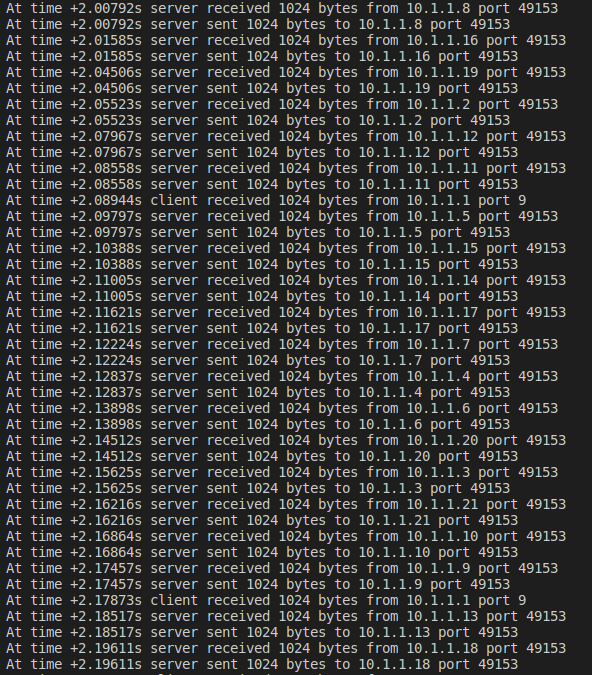
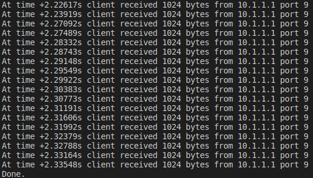

# udp-20-client-server-csma

Arquitetura cliente-servidor usando UDP: 20 clientes se comunicam simultaneamente com 1 servidor por meio do mesmo enlace, usando CSMA.

## Estrutura
Nessa simulação foi usada uma conexão por barramento, no qual estavam instalados o servidor e os 20 clientes, com a classe `CsmaHelper` do NS3. A rede foi testada com uma aplicação Echo UDP, com as classes correspondentes do NS3. Não foi simulada perda de pacotes UDP.
 - Data rate: 5Mbps
 - Delay: 2ms
 - Tamanho do pacote: 1024
 - Pacotes enviados por vez: 1

 ## Resultados
Diferente das conexões cabeadas ponto a ponto, nessa configuração os clientes devem usar o mesmo enlace um de cada vez, o que resulta em atrasos no envio e na resposta, apesar de todos os clientes enviarem as mensagens simultaneamente.

1. Os clientes enviam as mensagens todos ao mesmo tempo

2. O protocolo CSMA garante que o enlace seja usado para um cliente de cada vez, então apesar de os clientes terem comandado o envio da mensagem, ela só será enviada de fato quando o enlace estiver livre, isso é mostrado abaixo no tempo de recepção das mensagens pelo servidor, que tem um atraso de alguns milissegundos entre uma mensagem e outra (apesar de todas terem sido enviadas simultaneamente, como no passo 1)

3. Acima também é mostrado que o servidor "ecoa" imediatamente as mensagens recebidas. Porém, novamente, o protocolo de enlace (CSMA) faz com que a mensagem só seja enviada quando o canal estiver livre.

4. Como resultado, existe um atraso de alguns milissegundos na recepção da resposta pelos clientes.

## Conclusão (minha interpretação)
Aqui, esse atraso na propagação dos pacotes e a gestão dessa propagação é feita pelo próprio protocolo CSMA (pelo que entendi), não sendo "responsabilidade" do protocolo de transporte UDP (que não é confiável) que todos os 20 pacotes tenham sido enviados e ecoados. 

Algumas observações:
1. Não foi possível garantir que os pacotes foram entregues corretamente aos seus destinos (não consegui testar isso na simulação). Pode ser que os clientes tenham recebido pacotes ecoados de outros clientes, já que todas as aplicações inclusive usam o mesmo número de porta (até tentei especificar a porta da aplicação mas não encontrei uma função para isso).
2. Ao visualizar no NetAnim, é possível ver que, sempre antes de enviar um pacote, o nó envia um pequeno pacote antes, como se fosse uma varredura do canal para encontrar seu destino. Não necessariamente acontece antes do pacote ser enviado, há casos em que vários nós enviam esses "pequenos pacotes" um atrás do outro e, em seguida, enviam os pacotes da aplicação um atrás do outro **também**, então não é uma "varredura" para ver se o canal está livre (que era o que eu pensava inicialmente).
