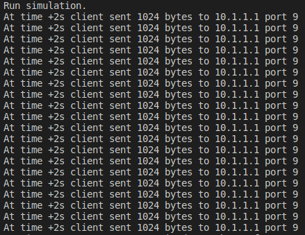

# udp-20-client-server-csma

Arquitetura cliente-servidor usando UDP: 20 clientes se comunicam simultaneamente com 1 servidor por meio do mesmo enlace, usando CSMA.

## Estrutura
Nessa simulação foi usada uma conexão por barramento, no qual estavam instalados o servidor e os 20 clientes, com a classe `CsmaHelper` do NS3. A rede foi testada com uma aplicação Echo UDP, com as classes correspondentes do NS3. Não foi simulada perda de pacotes UDP.
 - Data rate: 5Mbps
 - Delay: 2ms
 - Tamanho do pacote: 1024
 - Pacotes enviados por vez: 1

 ## Resultados e Conclusão
Diferente das conexões cabeadas ponto a ponto, nessa configuração os clientes devem usar o mesmo enlace um de cada vez, o que resulta em atrasos no envio e na resposta, apesar de todos os clientes enviarem as mensagens simultaneamente.

